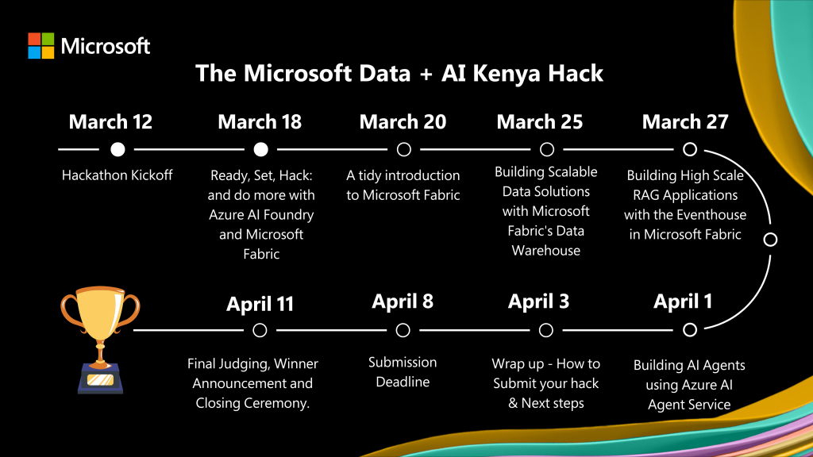

# MediTree

---


**MS - Data AI Hack Roadmap**

---

### Resources

- [Hack Together: The Microsoft Data + AI Kenya Hack](https://blog.fabric.microsoft.com/en/blog/hack-together-the-microsoft-data-ai-kenya-hack?ft=All)

- [Hackathon Documentation](https://microsoft.github.io/Data-AI-Kenya-Hack/)

- [Access to AZURE OpenAI](https://microsoft.github.io/Data-AI-Kenya-Hack/AI_ACCESS.html)


#### Model Details
| Mdel    | Model Name | Docs  | *(with Python) |
| -------- | ------- |---------| --------------
| GPT-4o | gtp-4o | [Docs](https://aka.ms/fabric-hack24-python-docs-gtp4) |
| GPT-4o-mini | gpt-4o-mini    | [Docs](https://aka.ms/fabric-hack24-python-docs-gtp4)|
| Embeddings    |  text-embedding-ada-002   | [Embeddings Docs](https://aka.ms/fabric-hack24-python-docs-embeddings)|
| DALL-E 3   | dall-e-3 | [DALL-E Docs](https://aka.ms/fabric-hack24-python-docs-dalle) | [Azure OpenAI DALL-E - Python](https://aka.ms/fabric-hack24-python-eg-dalle) | 

### Events
-----
```
March 18th @ 7 PM East African Time: Ready, Set, Hack: and do more with Azure AI and Microsoft Fabric
March 20th @ 7 PM East African Time: A tidy introduction to Microsoft Fabric
March 25th @ 7 PM East African Time: Building Scalable Data Solutions with Microsoft Fabric’s Data Warehouse
March 27th @ 7 PM East African Time: Building high scale RAG Applications with the Eventhouse in Microsoft Fabric
April 1st @ 7 PM East African Time: Building AI Agents using Azure AI Agent Service
April 3rd @ 7 PM East African Time: Wrap up – How to Submit your hack & Next steps
```
-----

#### Folder Structure
```
Meditree/
├── backend/
│   ├── main.py
│   ├── requirements.txt
│   └── README.md
├── frontend/
│   ├── (Tailwind/bootstrap) - for styling
    |-- .html
│   └── README.md
├── ai-models/
│   ├── image_recognition/
│   ├── language_model/
│   └── README.md
├── Mock data/
│   ├── plant_data.csv
│   └── weather_data.csv
├── README.md
└── demo-video.mp4
```

---

## MVP Features

- **Seedling Identification**: 
```
    - Upload an image of a Seedling, and MediTree AI will identify the plant using AZURE Vision.
```
- **Care Advice**: 
```
    - Get personalized care instructions, optimal conditions, and uses for the identified plant. Also give advice based on location.
```
- **Tree recommendations and Real-time weather intergration**:
```
    - Recommend trees to plant based on location and current season/weather conditions and suitable periods of the year to plant.
    - Weather-Based recommendations(ie, activities ie pruning)
``` 

- **Interactive Chatbot**: Ask questions and get AI-powered answers using AZURE OpenAI service

---
- **Tree marketplace**: 
```
Create a platform for users to buy and sell trees or gardening supplies.
    - Tree Listings: Allow nurseries or individuals to list trees for sale.
    - Gardening Supplies: Offer a marketplace for tools, seeds, and fertilizers.
    - User Reviews: Let users review and rate sellers.
```
                    

---
#### Stretch Goals and future additions

1. **Carbon Footprint Tracker**: Track environmental impact of tree planting efforts
2. **Articles/Blogs**: On Trees/Forests (Uses, myths,ongoing afforestation, reafforestation efforts)
3. **Virtual green advocates events to engage the community**: Host live sessions with experts on topics like gardening/tree care
4. **Eco-frriendly products**:
```
    - Recommend eco-friendly products , i.e; biodegradable pots, organic fertalizers
    - Share tips on reducing waste, conserving water(green tips)
```
        
5. **Intergration with local nurseries and organizations** : 
Build partnerships to enhance user experience.
```    
*Features:*
    -  Nursery Locator: Help users find local nurseries to buy trees or supplies.
    - Volunteer Opportunities: Connect users with local tree-planting events or organizations.connect tree enthusiasts with seedling dealers.
```
                
6. **Gamification and Social engagement**: 
        - Tree planting challenges, leaderboard, community goals
7. **Tree adoption and Donation**
8. **Personalized Planting calendar and reminders intergration**
9. **Educational content and quizzess**: 

`tree encyclopedia, DIY guides(ie, composting, mulching)`

10. **Tree Health Monitoring with IoT**:
```
    - soil sensors: monitor soil moisture, pH, nutrient
    - Smart watering
    - health dashboard

```


----

## Techstack
- **Backend**: FastAPI, MongoDB, Langchain
- **Frontend**: Tailwind CSS, JS
- **AI**: AZURE AI Vision
- **Deployment**: **

-----