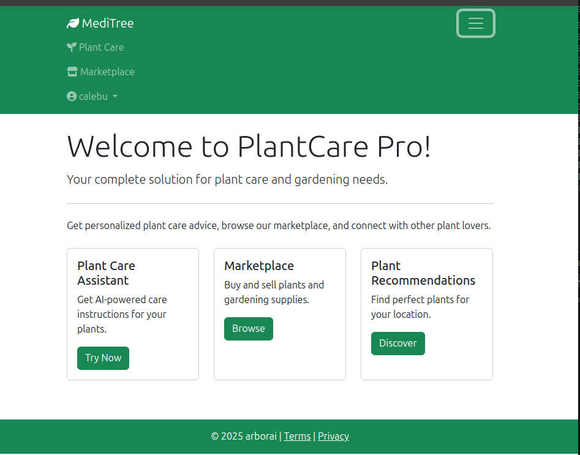

# 🌿 MediTree

---

_Sustainable Identification and Research of Medicinal Trees for Healthcare and Conservation_

---


A web application that provides personalized plant care advice, a plant marketplace,weather-based gardening recommendations and more.

## Resources


**MS - Data AI Hack Roadmap**

---

- [Hack Together: The Microsoft Data + AI Kenya Hack](https://blog.fabric.microsoft.com/en/blog/hack-together-the-microsoft-data-ai-kenya-hack?ft=All)

- [Hackathon Documentation](https://microsoft.github.io/Data-AI-Kenya-Hack/)

- [Access to AZURE OpenAI](https://microsoft.github.io/Data-AI-Kenya-Hack/AI_ACCESS.html)


#### Model Details
| Mdel    | Model Name | Docs  | *(with Python) |
| -------- | ------- |---------| --------------
| GPT-4o | gtp-4o | [Docs](https://aka.ms/fabric-hack24-python-docs-gtp4) |
| GPT-4o-mini | gpt-4o-mini    | [Docs](https://aka.ms/fabric-hack24-python-docs-gtp4)|
| Embeddings    |  text-embedding-ada-002   | [Embeddings Docs](https://aka.ms/fabric-hack24-python-docs-embeddings)|
| DALL-E 3   | dall-e-3 | [DALL-E Docs](https://aka.ms/fabric-hack24-python-docs-dalle) | [Azure OpenAI DALL-E - Python](https://aka.ms/fabric-hack24-python-eg-dalle) | 


#### Folder Structure
```
MediTree/
├── application/
│ ├── static/ # CSS, JS, images
│ ├── templates/ # HTML templates
│ ├── init.py # App factory
│ ├── auth.py # Authentication routes
│ ├── chatbot.py # AI chat functionality
│ ├── database.py # DB initialization
│ ├── forms.py # WTForms
│ ├── marketplace.py # Marketplace routes
│ ├── models.py # SQLAlchemy models
│ └── plantcare.py # Plant care routes
├── arborai.db/ # Database file
├── tests/ # Unit tests
├── .env # Environment variables
├── config.py # Configuration
└── run.py # Launch script
```
---

##  🚀 Features

### 🌱 AI Plant Care Assistant
- Chatbot powered by Azure OpenAI (GPT-4)
- Personalized care instructions
- Troubleshooting advice
- Optimal growing conditions

### 🌦️ Weather-Based Recommendations
- Location-specific plant suggestions
- Seasonal care tips
- Weather-appropriate gardening activities and reminders

### 🛒 Plant Marketplace
- Buy/sell plants and gardening supplies
- User reviews and ratings
- Seller profiles

### 👤 User Management
- Secure authentication with hashed passwords
- Personalized dashboards
- Saved plant collections

----

#### Stretch Goals and future additions

1. **🌱 Carbon Footprint Tracker**: Track environmental impact of tree planting efforts
```
Tree Carbon Calculator: Estimate CO₂ sequestration based on species, age, and location

User Impact Dashboard: Visualize lifetime environmental contributions

Planting Goals: Set and track carbon offset targets

Community Comparisons: Benchmark against local averages

```
2. **Articles/Blogs**: On Trees/Forests (Uses, myths,ongoing afforestation, reafforestation efforts)
3. **Virtual green advocates events to engage the community**: Host live sessions with experts on topics like gardening/tree care
4. **Eco-frriendly products**:
```
    - Recommend eco-friendly products , i.e; biodegradable pots, organic fertalizers
    - Share tips on reducing waste, conserving water(green tips)
```
        
5. **Intergration with local nurseries and organizations** : 
Build partnerships to enhance user experience.
```    
*Features:*
    -  Nursery Locator: Help users find local nurseries to buy trees or supplies.
    - Volunteer Opportunities: Connect users with local tree-planting events or organizations.connect tree enthusiasts with seedling dealers.
```
                
6. **Gamification and Social engagement**: 
        - Tree planting challenges, leaderboard, community goals
7. **Tree adoption and Donation**
8. **Personalized Planting calendar and reminders intergration**
9. **Educational content and quizzess**: 

`tree encyclopedia, DIY guides(ie, composting, mulching)`

10. **Tree Health Monitoring with IoT**:
```
    - soil sensors: monitor soil moisture, pH, nutrient
    - Smart watering
    - health dashboard

```
----


## Installation

1. **Clone the repository**
```
$ git clone https://github.com/kiptoobarchok/MediTree
$ cd MediTree

```

2. **Set up virtual environment**
```
$ python -m venv venv
$ source venv/bin/activate  # Linux/Mac
venv\Scripts\activate     # Windows
```

3. **Install dependencies**
```
$ pip freeze > requirements.txt # linux / windows copy the contents to .txt file
$ pip install -r requirements.txt
```

4. **Configure environment**
- Create `.env` file
```
SECRET_KEY=your-secret-key
AZURE_OPENAI_API_KEY=your-azure-key
AZURE_OPENAI_ENDPOINT=https://your-resource.openai.azure.com/
AZURE_OPENAI_CHAT_DEPLOYMENT=your-deployment-name
WEATHER_API=your-open-weather-map-api
```

5. initialize database
```
python3
>>> db.create_all()
>>> exit()
```


6. Access the development server via browser engines

```
$ cd MediTree
$ source venv/bin/activate
$ python run.py
$ 
```

----

### Usage
1. Register an account or login to an existing account
2. Access ArborAI our plantcare assistant for advice
3. Browse marketplace listings
4. Add your own plants for sale
5. Cet weather-based recommendations

#### 📚 Documentation
- [Flask Documentation](https://flask.palletsprojects.com/)
- [Azure OpenAI API Docs](https://learn.microsoft.com/en-us/azure/ai-services/openai/)
- [Bootstrap 5 Docs](https://getbootstrap.com/docs/5.3/getting-started/introduction/)

 --- 

 ## 🤝 Contributing
 1. Fork the github repository
 2. Create your feature branch 
 ```
 git checkout -b feature/AmazingFeature
 ```
 3. Commit your changes 
 ```
 git commit -m 'Add some AmazingFeature'
 ```
 4. Push to the branch 
 ```
 git push origin feature/AmazingFeature
 ```
 5. Open a pull request

 ### 📜 License

Distributed under the MIT License. See `LICENSE` for more information.

# MediTree Home



#### Contact

- [KIPTOO CALEB](https://wa.me/+254702171495)
- [MATHEW CHALO](https://wa.me/+254746269567)
- [ZIPPORAH MORANGI](https://wa.me/+254701319766)
